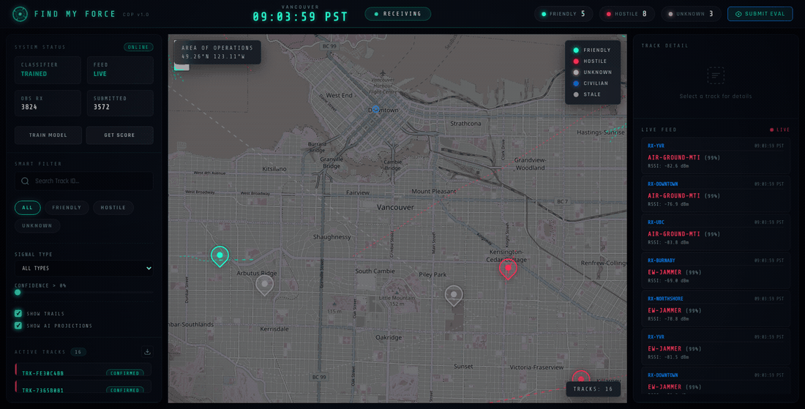
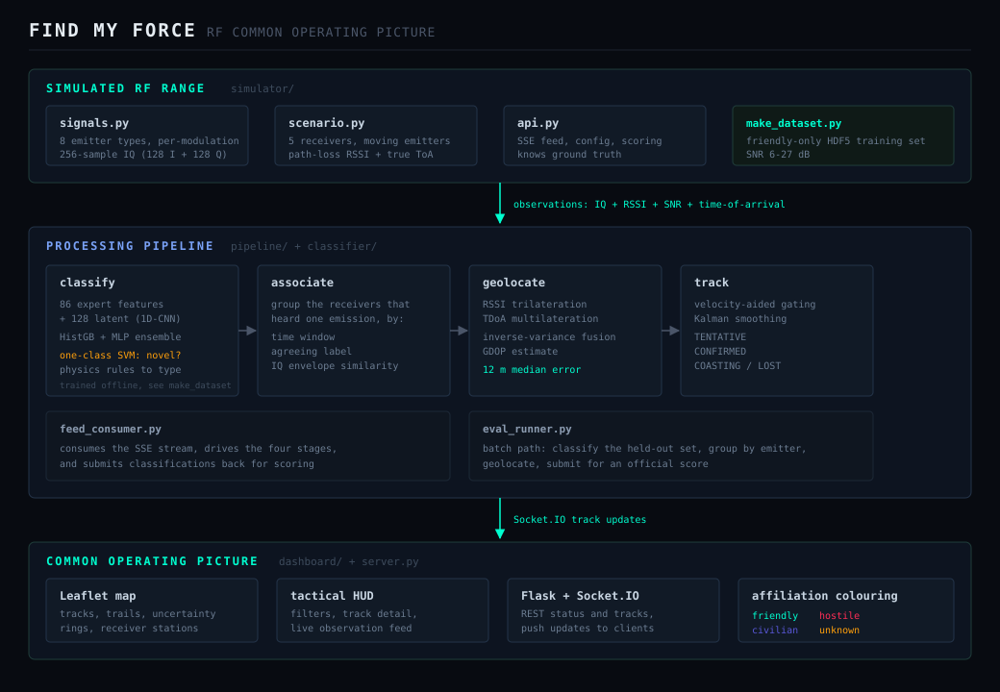
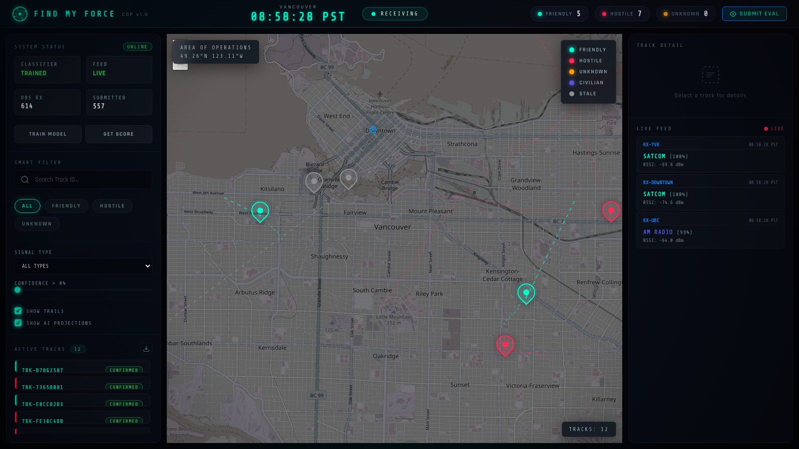

# Find My Force — RF Common Operating Picture

**Real-time RF signal classification, emitter geolocation, and multi-target tracking.**

Passive receivers pick up radar and comms emissions. The pipeline classifies each one,
flags anything that isn't a known friendly, trilaterates the emitter from RSSI and
time-of-arrival, and tracks it across a live tactical map.

🥈 **2nd Place — UBC Defence Tech Hackathon 2026** (LockedIn challenge)



---

## Table of Contents

- [Overview](#overview)
- [Key Features](#key-features)
- [Architecture](#architecture)
- [Tech Stack](#tech-stack)
- [Prerequisites](#prerequisites)
- [Getting Started](#getting-started)
- [CLI Reference](#cli-reference)
- [Deployment](#deployment)
- [How It Works](#how-it-works)
- [Results](#results)
- [Project Structure](#project-structure)
- [Engineering Notes](#engineering-notes)
- [Limitations](#limitations)
- [Notes](#notes)

---

## Overview

Electronic warfare starts with a question that sounds simple: *what is transmitting, and
where is it?* Answering it means turning raw IQ samples into a labelled, positioned,
tracked picture of everything radiating in an area — fast enough to act on.

Find My Force does that end to end. Eight emitter types transmit across greater
Vancouver — friendly altimeters and satcom links, hostile surveillance and
range-finding radars, a barrage jammer, a civilian AM station. Five passive receivers
hear each emission at different strengths and different arrival times. From that alone
the system works out *what* each emitter is and *where* it sits, to within about
12 metres, and keeps a stable track on it as it moves.

The hackathon ran against an organiser-hosted RF range that no longer exists. Rather
than let the project rot into an unrunnable demo, **it now ships its own simulated
range**. Everything below runs offline: no API keys, no external data, no network.

---

## Key Features

**Hybrid signal classifier** — 86 hand-engineered features (envelope statistics,
spectral flatness, higher-order cumulants, LPC coefficients, phase histograms) fused
with 128 latent features from a 1D-CNN trained directly on raw IQ, classified by a
soft-voting HistGradientBoosting + MLP ensemble.

**Novelty detection for unknown threats** — a one-class SVM fitted only on friendly
signals flags anything out-of-distribution, so a hostile emitter never seen in training
is still caught. Flagged signals are then resolved to a specific type by physics-based
rules on crest factor, spectral flatness and duty cycle.

**Hybrid geolocation** — RSSI trilateration (nonlinear least squares over a path-loss
model) fused with TDoA multilateration (hyperbolic positioning) by inverse-variance
weighting, with GDOP reported per fix. **12 m median position error.**

**Multi-target tracking** — observations from separate receivers are associated into
single emissions, then matched to tracks through a velocity-aided gate and smoothed by
a constant-velocity Kalman filter, with a full TENTATIVE → CONFIRMED → COASTING → LOST
lifecycle.

**Live tactical dashboard** — Leaflet map with affiliation-coloured tracks, movement
trails, uncertainty rings, receiver stations, a filterable track list and a streaming
observation feed, pushed over Socket.IO.

**Self-contained RF simulator** — synthesises the whole environment from first
principles, including per-receiver multipath and thermal noise, and scores your
submissions against ground truth it holds back.

**Reproducible runs** — `--seed` pins the scenario so pipeline changes can be compared
against a fixed environment instead of a fresh random one.

---

## Architecture



Data flows one way. The simulator emits observations over Server-Sent Events; the
pipeline classifies, associates, geolocates and tracks; the dashboard receives track
updates over Socket.IO. Because the simulator re-implements the original range API
exactly, pointing `API_URL` at a real feed instead would need no pipeline changes.

---

## Tech Stack

| Layer | Technology |
|---|---|
| Deep learning | PyTorch (1D-CNN feature extractor) |
| Classical ML | scikit-learn (HistGradientBoosting, MLP, One-Class SVM, QuantileTransformer, probability calibration) |
| Signal processing | NumPy, SciPy (FFT, Haar wavelets, Yule-Walker LPC, autocorrelation) |
| Optimisation | SciPy `least_squares` (trilateration and multilateration) |
| Backend | Flask, Flask-SocketIO, gevent |
| Frontend | Leaflet.js, Socket.IO client, vanilla JS, custom CSS (glassmorphism / neon HUD) |
| Data | HDF5 via h5py, joblib model bundles |

---

## Prerequisites

- **Python 3.11+** (3.11 recommended; PyTorch wheels for 3.9 are unreliable on Apple Silicon)
- **pip** and **venv**
- ~2 GB free disk for PyTorch and its dependencies
- A modern browser
- No API keys, no GPU, no network access required

---

## Getting Started

**1. Clone and install**

```bash
git clone https://github.com/lumixed/RedTeamHack.git
cd RedTeamHack
python3 -m venv venv
source venv/bin/activate
pip install -r requirements.txt
```

**2. Configure**

```bash
cp .env.example .env
```

The defaults point at the local simulator. Nothing else needs changing.

**3. Generate training data and train the classifier**

```bash
python3 -m simulator.make_dataset
python3 main.py train
```

Takes about two minutes on a laptop CPU. Writes `data/training.h5` and
`models/classifier.joblib`.

**4. Start the simulated RF range** (terminal 1)

```bash
python3 main.py simulate --port 5051
```

**5. Start the dashboard** (terminal 2)

```bash
python3 main.py server --port 5050
```

**6. Open** http://localhost:5050

Tracks appear within about 30 seconds — the tracker needs two consistent updates before
promoting a track to CONFIRMED. Click any track for classification confidence, GDOP,
velocity and signal history. Press **SUBMIT EVAL** to score the pipeline against the
simulator's held-out set.



---

## CLI Reference

```bash
python3 main.py simulate [--port 5051] [--emitters 8] [--seed 5]
python3 main.py server   [--port 5050] [--debug]
python3 main.py train
python3 main.py stream          # print the raw observation feed
python3 main.py score           # current running score
python3 main.py eval            # run the scored evaluation submission
python3 -m simulator.make_dataset [--per-bucket 160] [--seed 42]
```

---

## Deployment

The whole system — simulated range and dashboard — ships as **one container**. The
entrypoint starts the range, waits for it to answer, then starts the server, and brings
the container down if either half dies so the platform restarts it cleanly.

```bash
fly launch --no-deploy    # first time only, to claim an app name
fly deploy
```

`fly.toml` and `Dockerfile` are already configured for a `shared-cpu-1x` / 1 GB machine.
Any Docker host works the same way:

```bash
docker build -t findmyforce .
docker run -p 8080:8080 findmyforce
```

Three things worth knowing about how this is packaged:

**The model is built during the image build, not committed.** The Dockerfile generates
the training set, fits the classifier, then deletes the raw data. Nothing binary lives in
git, and every image is reproducible from source.

**Torch comes from the CPU-only index.** On Linux, a plain `pip install torch` resolves
to the CUDA build and drags in several gigabytes of NVIDIA runtime that this project
never touches. The Dockerfile pins the CPU wheel index before installing anything else.

**It idles at zero cost.** This is not a request/response app — the pipeline classifies
continuously whenever the machine is up, so an always-on instance burns CPU with nobody
watching. The machine is therefore allowed to stop when idle.

The catch is that a stopped machine has to rebuild its entire picture, and the tracker
will not confirm a track until it has seen two emissions from that emitter. So startup
pre-rolls 25 seconds of scenario into a replay buffer, and the pipeline drains it while
the server is still coming up. The map is already populated by the time the app answers
its first request, rather than showing an empty map for another half-minute:

| From cold | Local | Deployed (Fly, shared-cpu-1x) |
|---|---|---|
| App answers first request | 1.6s | 31s |
| Full picture, 8 confirmed tracks | 9.0s | 33s |

Nearly all of the deployed number is machine boot plus importing torch and loading the
model on a shared vCPU — not the pipeline, which contributes the last two seconds. A
visitor waits about half a minute for the page, then sees a complete picture immediately.
Set `min_machines_running = 1` in `fly.toml` to trade roughly $5/month for instant loads.

---

## How It Works

### Signal simulation

Each emitter type is generated from its actual modulation rather than being drawn from
a distribution and labelled. The statistics the classifier keys on therefore *emerge*
from the waveform:

| Emitter | Modulation | Affiliation |
|---|---|---|
| Radar-Altimeter | FMCW sweep, constant envelope | friendly |
| Satcom | pulse-shaped QPSK | friendly |
| short-range | ASK burst | friendly |
| Airborne-detection | narrowband pulse, moderate duty | hostile |
| Airborne-range | polyphase-coded pulse compression | hostile |
| Air-Ground-MTI | very short, very sharp pulse | hostile |
| EW-Jammer | barrage noise across the passband | hostile |
| AM radio | double-sideband AM | civilian |

For every emission the simulator computes each receiver's RSSI from the path-loss model
and its time of arrival from true propagation delay, then applies that receiver's own
multipath echo and thermal noise. All receivers share the underlying waveform — which
is precisely what lets the associator recognise them as observations of one event.

### Classification

Manual features and CNN latents are concatenated into a 214-dimensional hybrid vector,
quantile-scaled, and passed to the calibrated ensemble. In parallel, the one-class SVM
scores the same vector for novelty. Anything flagged novel is routed to physics-based
rules — a crest factor above 8 with duty cycle under 10% is a moving-target indicator;
spectrally flat with a low crest factor is barrage jamming; and so on.

### Geolocation

RSSI is inverted through the path-loss model into a range estimate and trilaterated by
SNR-weighted nonlinear least squares. Time-of-arrival differences give an independent
hyperbolic fix by multilateration, seeded from the RSSI solution to avoid local minima.
The two are fused by inverse-variance weighting, so whichever is better conditioned at
that geometry dominates. TDoA usually wins, which is why median error lands near 12 m
rather than the few hundred metres RSSI alone would give.

### Tracking

Grouped observations are matched against existing tracks using a Kalman-predicted
position rather than the last known one, so fast movers still associate. Confirmed
tracks smooth position and velocity through the filter; tracks that stop being observed
coast, then are dropped.

---

## Results

Measured against simulator ground truth over 335 observations spanning 10–26 dB SNR:

| Metric | Result |
|---|---|
| End-to-end label accuracy, all 8 types | **89.3%** |
| Position error (hybrid TDoA + RSSI) | **12 m** median, 22 m p90 |
| Evaluation submission score | **98.4 / 100** |
| Friendly 3-class F1 (macro) | 1.00 |
| Steady-state tracking | 8 stable tracks for 8 emitters |

Per-type accuracy, which is more informative than the headline:

| Emitter | Accuracy |
|---|---|
| Airborne-detection | 100.0% |
| Air-Ground-MTI | 100.0% |
| Satcom | 91.1% |
| AM radio | 88.1% |
| Airborne-range | 85.7% |
| short-range | 85.4% |
| Radar-Altimeter | 82.9% |
| EW-Jammer | 80.0% |

The 1.00 friendly F1 is the *easy* sub-task — three very different modulations at
workable SNR — and is reported for completeness rather than as the headline. The number
that matters is the 89.3% across all eight types, where novelty detection and type
resolution both have to be right.

EW-Jammer is the weakest class for a defensible reason: a long polyphase-coded radar
pulse and continuous barrage noise are genuinely similar signals once multipath smears
the spectrum. The discriminator is the pulsed envelope, and it degrades gracefully
rather than failing outright.

---

## Project Structure

```
simulator/
  signals.py         synthetic IQ waveform generation, one function per emitter type
  scenario.py        receiver network, moving emitters, per-receiver observation model
  api.py             stand-in range API: SSE feed, config, ground-truth scoring
  make_dataset.py    writes the labelled HDF5 training set
classifier/
  signal_classifier.py   feature extraction, 1D-CNN, ensemble, novelty detector
pipeline/
  feed_consumer.py   SSE consumption and submission
  associator.py      groups co-observations of one emission
  geolocator.py      RSSI trilateration, TDoA multilateration, fusion, Kalman
  track_manager.py   track lifecycle and smoothing
  eval_runner.py     batch evaluation and scoring path
dashboard/
  index.html         tactical HUD layout
  app.js             Leaflet, Socket.IO, filtering, track rendering
  style.css          HUD styling
server.py            Flask + Socket.IO backend
main.py              unified CLI
```

---

## Engineering Notes

A few decisions worth calling out, since they shaped the results more than the model
choice did.

**Match the novelty detector's training SNR to its deployment SNR.** An early dataset
spanned −10 dB, where friendly signals are essentially noise. That taught the one-class
SVM that noise is normal, and the barrage jammer — which *is* noise — sailed through as
friendly. EW-Jammer recall sat at 30%. Narrowing training to the SNR range the receivers
actually deliver took it to 89%.

**Calibrate the novelty threshold to the model you fitted.** The detector is fitted with
`nu = 0.05`, meaning a 5% outlier fraction, but the cutoff was originally calibrated at
the 15th percentile — overriding `nu` and tripling the false-positive rate on friendly
signals. Those false positives don't just mislabel: they split an emission's
observations across association groups and fork duplicate tracks.

**Don't emit an association group before the emission has finished arriving.** The
associator originally flushed a group as soon as three receivers had reported, but it
runs after *every* observation — so receivers four and five arrived late, formed a
second group, geolocated on their own, and spawned a duplicate track for the same
emitter. Track count grew without bound. The tell was every track reporting exactly
three receivers.

**Every state in a lifecycle enum needs an exit.** Track ageing handled CONFIRMED and
TENTATIVE but not COASTING, so a coasting track could never reach LOST or be deleted —
an unbounded leak that only a long-running feed reveals.

**Geometry beats algorithms.** Confining emitters to the interior of the receiver
polygon cut p90 position error from 106 m to 22 m without touching a line of solver
code. Dilution of precision does what the textbook says it does.

---

## Limitations

Worth being direct about, since this is a portfolio piece rather than a product:

- **The performance numbers describe the pipeline against the simulator**, which is the
  same environment its thresholds were tuned in. They are a solid regression baseline,
  not a claim about real-world RF.
- **About 13% of friendly observations are still flagged as novel.** That is the
  deliberate cost of the original scoring function putting 30% of the total on novelty
  detection, so the model is tuned to miss few hostiles at the price of some false
  alarms. Tighten `OOD_PERCENTILE` in `classifier/signal_classifier.py` to trade the
  other way.
- **Classification runs at roughly 14 observations/second** single-threaded (~73 ms per
  snapshot). The simulator is paced to stay inside that budget; a faster feed would need
  batched inference.
- **The simulator models a flat-earth propagation environment** — no terrain masking, no
  antenna patterns, no Doppler.

---

## Notes

Built for the LockedIn challenge at the UBC Defence Tech Hackathon 2026, then rebuilt to
run standalone after the competition infrastructure went offline.

No license file yet — add one before sharing this publicly if you want others to reuse it.
